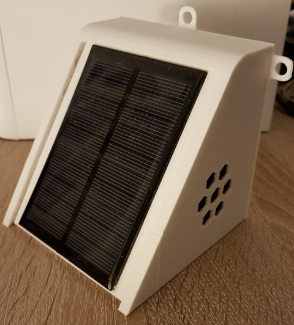
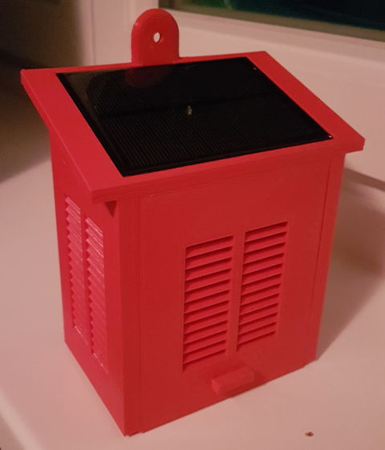
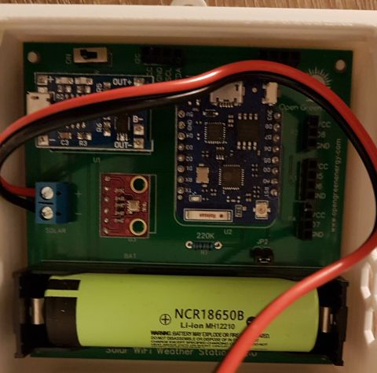
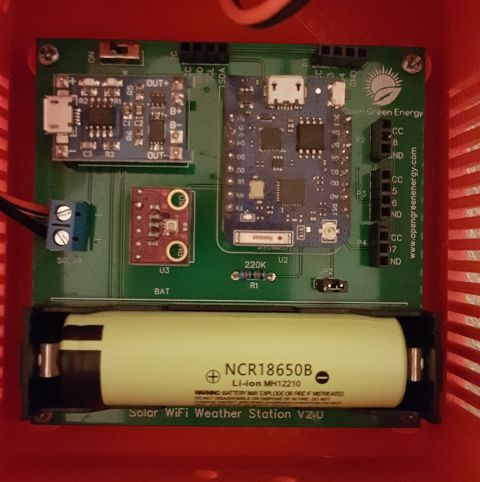
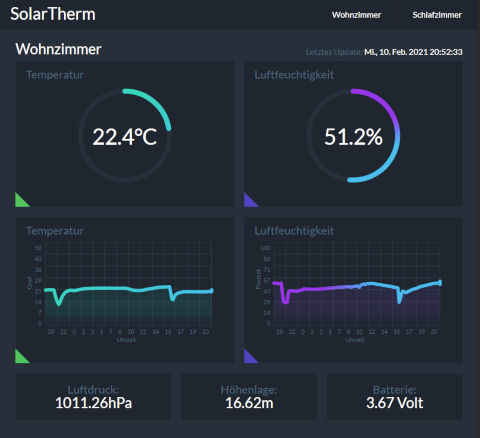
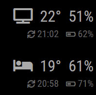

# SolarTherm WiFi Local Admin aka. Solar Powered WiFi Weather Station V2 (IoT device)

A solar powered, wifi connected thermometer implemented with ESP8266 and BME280.

## Features

Solar Powered WiFi Weather Station is:
- a **wireless** IoT device,
- that is powered by battery which is charged by **solar energy**,
- and connects to your **WiFi** network.

SolarTherm WiFi Local Admin is able to:
- periodically measure **temperature and humidity**,
- forward the measured data to local network storage, webspace or **[MagicMirror](https://github.com/MichMich/MagicMirror)**,
- save battery power by going to **deep sleep** between measurement cycles,
- render a **configuration webpage** to set your WiFi credentials,
- automatically update itself with ESP8266 HTTP Update.

SolarTherm WiFi Local Admin isn't:
- just another clone of all existing solutions ;-)
- a project for beginners (because of missing examples or explanations ;-) )
- really done yet
- well coded
- well documented

## On this page

- [Features](#features)
- [ToDo](#todo)
- [Getting started](#getting-started)
  - [Before you really start](#before-you-really-start)
  - [Hardware](#hardware)
  - [Software](#software)
  - [Configuration](#configuration)
- [Sending measured data](#sending-measured-data)
  - [Local Storage](#local-storage)
    - [Configuration](#configuration-1)
    - [Limitation](#limitation)
  - [MagicMirror](#magicmirror)
    - [Configuration](#configuration-2)
    - [Limitation](#limitation)
- [Over-the-air updates (OTA)](#over-the-air-updates-ota)
  - [Security disclaimer](#security-disclaimer)
  - [Prerequisites](#prerequisites)
  - [Steps](#steps)
  - [How it works](#how-it-works)
  - [Troubleshooting](#troubleshooting)
    - [Monitoring the upload](#monitoring-the-upload)
- [Acknowledgements](#acknowledgements)
- [About the author](#about-the-author)

(This Table of Contents was manually created by myself. :-P)

## ToDo

A lot. Will come soon.

## Getting started

### Before you really start

This project is really early development stage and need improvements everywhere especially on security aspects.
It is working in my environment with 2 of this wifi IoT devices. This means it is possible to replicate it on other devices too.

- Everything what you use from this project you use it at your own risk.
- I'll not responsible for any health or device damage.
- I'm not going to teach you how to install a LAMP stack on RPI or other. There are many How To's around the internet to successfully have this done.

If you need external services like ThingSpeak, Blynk, IFTTT or MQTT you should use the original [Arduino Sketch](https://www.instructables.com/id/Solar-Powered-WiFi-Weather-Station-V20/) or clones around this project. I'm personally not using this services for such kind of project.

For example:
- https://github.com/3KUdelta/Solar_WiFi_Weather_Station 
- https://github.com/balassy/solar-wifi-weather-station 

### Hardware

Build the hardware recommended by Open Green Energy in his [Solar Powered WiFi Weather Station v2.0](https://www.instructables.com/id/Solar-Powered-WiFi-Weather-Station-V20/) project.

Here i have some images from my SolarTherm thermometer devices (cases from Debasish Dutta and Marc Stähli):

### Software

This project was built with love <3 and the [Arduino IDE](https://www.arduino.cc/en/Main/Software) to compile and upload it to the Wemos board. 
You have to install the following libraries this project depends on to your development environment:
- [WiFiManager](https://github.com/tzapu/WiFiManager.git) by tzapu (tested with version 0.16.0).

### Configuration

Rename the `config.sample.h` file to `config.h`, and modify the values. 
If you want to use more than one device then rename the file to something like `config-one.h` and `config-two.h` and so on. 
Declare the correct file in `solartherm-wifi-local-admin.ino` (comment out existing others declared there). You can only have one device config to build the binary.

See the sections below for more information about the particular features that can be configured in this file.

After turning on the device the first time it will enter into configuration mode. 
In configuration mode SolarTherm acts as a WiFi access point.

The SSID name and the password to connect to this access point can be specified in the `WIFI_AP_SSID` and `WIFI_AP_PASSWORD` parameters in `config.h`. 
Use your computer to connect to this network, then navigate to `http://192.168.4.1` in your web browser to open the configuration portal where you can select the preferred wireless network and set the WiFi password for SolarTherm.

**Important:** SolarTherm will wait for user interaction only for 60 minutes on the configuration portal, then restarts automatically. 
This timeout can be configured in the `WIFI_CONFIG_PORTAL_TIMEOUT_SECONDS` parameter in `config.h`.

## Sending measured data

SolarTherm collects sensor data and forwards them to local network storage or MagicMirror.

### Local network storage

Nearly every local network storage with Apache, PHP, MySQL and filesystem write permissions are possible e.g. RPI. 
LAMP stack should not that old. Something newer like actual Raspbian light with manually installed and properly configured services. 
Don'forget to secure up you stack if you want to call the webpage with measured and styled data from outside your local network.

If you want to have this as docker installation i'm sure you will find what sweats your needs. I'm not going to provide or support it.

#### Configuration

The explanation is not done well. I have to correct it and explain some more detailed steps in the future. 
To set up the config files on you local network LAMP stack:

1. Copy the content of admin folder directly to the location on your LAMP stack webroot or subfolder.
2. Create a API key with PHP password_hash generator `generate-password.php` located in admin folder
   - `S47TnP3pp3R` should a self defined salt what you have to set inside `remote-temperature.php`
   - you should delete the file from the folder after generation
3. In `remote-temperature.php` file you have to enter your MySQL database credentials (here i use only localhost if you want to use something else feel free to adjust it)
4. If you want to have a styled webpage with your measured data you have to enter the database credentials in the `get-data.php` file too.
5. In SolarTherm's `config.h` specify:
   - the URL where to send the data `LOCAL_STORAGE_HOST`
   - hostname for device identification `LOCAL_STORAGE_HOSTNAME`
   - and API key `LOCAL_STORAGE_API_KEY` you created in step 2.

That's it! In every measurement cycle SolarTherm will push the data to your local network storage.

#### Web Interface

Just put your database credentials where you store your measured SolarTherm data in `get-data.php`.
If your LAMP is properly configured you can open you web browser and point to the URL you specified in your webserver configuration (virtual host whatever).

You will get a responsive webpage like the following image:

At this moment i only provide german language in the `index.html` file. Feel free to adjust this for your own content.
Webpage was tested with Chrome and Firefox. Responsive design should work on mobiles too.

#### Limitation

Will come soon

### MagicMirror

[Magic Mirror](https://magicmirror.builders/) (known as MagicMirror²) is an open source, modular smart mirror platform, and SolarTherm is able to push measured temperature, humidity and battery level data to MagicMirror to display them immediately.

An example display of the measured data on MagicMirror may look like this:

#### Configuration

To set up the SolarTherm MagicMirror connection follow these steps:

1. Install the [MMM-RemoteTemperature](https://github.com/balassy/MMM-RemoteTemperature) module on your MagicMirror (multiple definitions are possible).
2. Configure the module as you prefer.
3. In SolarTherm's `config.h` specify:
   - the protocol, address and host in the `MAGIC_MIRROR_HOST` parameter.
   - sensorId to identify device on MagicMirror module config `MAGIC_MIRROR_SENSORID`

That's it! In every measurement cycle SolarTherm will push the data to your MagicMirror.

#### Limitation

Will come soon

## Over-the-air updates (OTA)

ESP8266 [supports](https://arduino-esp8266.readthedocs.io/en/latest/ota_updates/readme.html) over the air updates out of the box, so you can load the firmware to the ESP using Wi-Fi connection rather than a serial port. 
In this project only the ESP8266httpUpdate from OTA is available because all other solutions are not suitable due to the deep sleep functionality what is used in this project.

### Security disclaimer

Make sure you read the [Security disclaimer](https://arduino-esp8266.readthedocs.io/en/latest/ota_updates/readme.html#security-disclaimer) and other security related sections in the official documentation to understand the risks!

### Prerequisites

- LAMP stack ideally on your local network running RPI and/or
- webspace at your desired webhost service with access to Apache, PHP and r/w permissions
- familiar with building binaries on Arduino IDE
- Optional: Have the initial SolarTherm setup done and running (not reachable hosts have a time out on SolarTherm side)

### Limitations

In this stage the over the air update only receive over unsecure protocol (http instead of https) what is no problem in my local network because i don't need it SSL based.

If you want a secure SSL connection transfer for your binary SolarTherm builds you have to extend the `ota-updater.cpp` to provide a security parameter.

It is somehow risky to use it with webspace hoster due to the scripts on LAMP stack side. They are more drafts and inspiration for further development.

### Steps

1. Customize the parameters in `config.h`:
   - URL of update host `OTA_UPDATE_HOST` (could also IP address or Dynamic DNS)
   - use Port `OTA_UPDATE_PORT`
   - Path on your webroot where the update script `ota-update.php` is located `OTA_UPDATE_SCRIPT_PATH`
   - defines the name for your device `OTA_UPDATE_VERSION` to identify the correct `*.bin` sketch file
2. Define the MAC address of your devices inside the PHP array config `ota-update.php` with the name you defined in `config.h`
3. Build the device binary file with your Arduino IDE, name the file you defined under `OTA_UPDATE_VERSION`
4. Upload the file to your webroot defined in step 1 for example: `solartherm-ota/bin` folder
5. Load the initial version of the code to the ESP through USB.
6. Device should reset automatically after transfer

### How it works

Every time you build a new binary you get a new md5 checksum for your compiled file.

- You upload the file to your webroot.
- If a device is awaking from deep sleep, the device script make a request with additional header information to your LAMP stack.
- This header information have special content like the MAC address and md5 checksum of installed device firmware.
- The script identify the MAC address with associated device name, check the md5 of binary to serve the correct file to the requesting device.
- After receiving new firmware the device will automatically reset.
- You can serve as many binaries you want to have from this location ideally related to your amount of existing SolarTherm devices.
- Each SolarTherm device have its own binary. Done. You never have to connect to serial USB connection again as long the binary is valid and your battery is healthy

### Troubleshooting

#### Monitoring the upload

During upload your ESP device will send debug log messages through the serial port. So if OTA does not work, connect your device to your computer, start a serial monitoring tool (e.g. [Termite](https://www.compuphase.com/software_termite.htm)), and start the OTA update through the wireless network.

You can customize the messages in the `ota-updater.cpp` file.

## Acknowledgements

Thanks to Open Green Energy for sharing his [Solar Powered WiFi Weather Station v2.0](https://www.instructables.com/id/Solar-Powered-WiFi-Weather-Station-V20/) project.

## About the author

This project is maintained by [Maja Aurora Pieper](https://github.com/coderpussy).